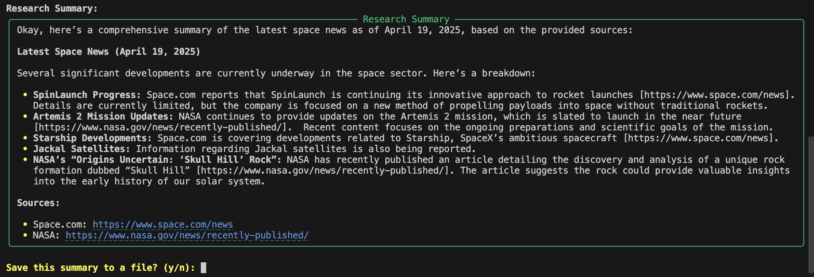
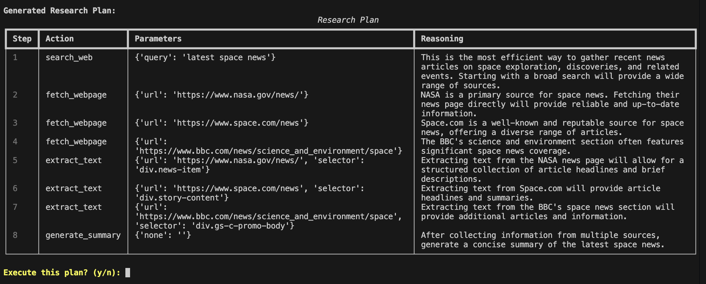

# ResearchGPT - AI Research Assistant

[](https://opensource.org/licenses/MIT)
[](https://www.python.org/downloads/)
[](https://ollama.com/)
[](https://github.com/l1v0n1/ResearchGPT/actions/workflows/python-tests.yml)
[](https://github.com/l1v0n1/ResearchGPT/actions/workflows/lint.yml)
[](https://github.com/l1v0n1/ResearchGPT/actions/workflows/docker-build.yml)

A powerful AI research assistant that provides comprehensive research summaries by querying internal documents and web resources, powered by local Ollama models. Built for privacy and flexibility with no external API dependencies.



## Features

- **Local LLM Integration**: Runs entirely locally using Ollama - no API keys or cloud services required.
- **Intelligent Research Planning**: Creates structured research plans based on your queries.
- **Web Search Capabilities**: Searches and extracts relevant information from web sources.
- **Document Management**:
  - Index and search through local documents using vector embeddings
  - Support for multiple file types including PDFs and text files
  - Robust error handling and content extraction
- **Knowledge Storage**:
  - Save research summaries with meaningful filenames based on queries
  - View and manage your collection of saved summaries
  - Organized in YAML frontmatter format with metadata
- **Interactive Experience**:
  - Command-line interface with rich output formatting
  - Interactive mode for continuous research sessions
  - Support for dry-run preview of research plans

## Installation and Setup

### Prerequisites

- Python 3.10 or higher
- [Ollama](https://ollama.com/) installed and running
- At least one Ollama model pulled (e.g., `ollama pull gemma3:latest`)
- An Ollama embedding model (e.g., `ollama pull nomic-embed-text`)

### Installation

1. **Clone the repository**:
   ```bash
   git clone https://github.com/l1v0n1/ResearchGPT.git
   cd ResearchGPT
   ```

2. **Create and activate a virtual environment**:
   ```bash
   python -m venv .venv
   source .venv/bin/activate  # On Windows: .venv\Scripts\activate
   ```

3. **Install dependencies**:
   ```bash
   pip install -r requirements.txt
   ```

4. **Set up environment variables**:
   ```bash
   cp .env.example .env
   # Edit .env with your specific configuration
   ```

## Docker Usage

### Using Pre-built Docker Images

You can run ResearchGPT using our pre-built Docker images:

```bash
# Pull the lightweight version (recommended for most users)
docker pull ghcr.io/l1v0n1/researchgpt:lite

# Run the container, connecting to Ollama on the host machine
docker run --rm -it -e OLLAMA_BASE_URL=http://host.docker.internal:11434 ghcr.io/l1v0n1/researchgpt:lite
```

### Building Locally

Several Dockerfile variants are available:

1. **Lightweight version** (recommended): 
   ```bash
   docker build -t researchgpt:lite -f Dockerfile.lite .
   ```

2. **Alpine version** (full features, smaller image):
   ```bash
   docker build -t researchgpt:alpine -f Dockerfile .
   ```

3. **Debian version** (full features, better compatibility):
   ```bash
   docker build -t researchgpt:debian -f Dockerfile.debian .
   ```

### Connecting to Ollama

When running the Docker container, you need to tell it how to reach Ollama:

```bash
# For macOS/Windows (Docker Desktop)
docker run --rm -it -e OLLAMA_BASE_URL=http://host.docker.internal:11434 researchgpt:lite

# For Linux
docker run --rm -it -e OLLAMA_BASE_URL=http://172.17.0.1:11434 researchgpt:lite
# OR use host networking
docker run --rm -it --network=host -e OLLAMA_BASE_URL=http://localhost:11434 researchgpt:lite
```

### Persisting Data

Mount volumes to persist data between container runs:

```bash
docker run --rm -it \
  -v ./data:/app/data \
  -e OLLAMA_BASE_URL=http://host.docker.internal:11434 \
  researchgpt:lite
```

## Usage

### Basic Research Query

Run a research query and get a comprehensive summary:

```bash
python -m app.cli "What are the latest advancements in quantum computing?"
```

When you run a query, the agent first creates a research plan:



Then it executes the plan and provides a comprehensive summary:


### Interactive Mode

Start an interactive session for multiple queries and document management:

```bash
python -m app.cli --interactive
```

### Document Management

Index a document for future reference:
```bash
python -m app.cli --index-document path/to/document.pdf
```

List all indexed documents:
```bash
python -m app.cli --list-documents
```

Index all documents in a directory:
```bash
python -m app.cli --index-directory path/to/documents/
```

### Summary Management

List all saved research summaries:
```bash
python -m app.cli --list-summaries
```

View a specific summary:
```bash
python -m app.cli --view-summary filename.md
```

Research summaries are saved in Markdown format with YAML frontmatter metadata:

```yaml
---
title: Research Summary
query: "tell me latest news about space"
date: 2025-04-19 16:32:58
---

Okay, here's a comprehensive summary of the latest space news as of April 19, 2025:

**Latest Space News (April 19, 2025)**

Several significant developments are currently underway in the space sector:

* **SpinLaunch Progress:** Continuing its innovative approach to rocket launches
* **Artemis 2 Mission Updates:** NASA's ongoing preparations and scientific goals
* **Starship Developments:** SpaceX's ambitious spacecraft progress
* **NASA's "Origins Uncertain: 'Skull Hill' Rock":** Discovery and analysis of a unique rock formation

...
```

## Project Structure

```
ResearchGPT/
├── agent/                # Core AI agent components
│   ├── config.py         # Configuration settings
│   ├── model.py          # Ollama wrapper
│   ├── memory.py         # Knowledge storage
│   ├── planner.py        # Research planning module
│   ├── executor.py       # Plan execution engine
│   ├── logger.py         # Logging utilities
│   └── tools/            # Research tools
│       ├── web.py        # Web search functionality
│       └── documents.py  # Document retrieval and indexing
├── app/                  # User interfaces
│   └── cli.py            # Command-line interface
├── data/                 # Data storage
│   ├── documents/        # Indexed document storage
│   └── summaries/        # Saved research summaries
├── logs/                 # Application logs
├── tests/                # Testing suite
├── docs/                 # Documentation
│   ├── summary.md        # Detailed implementation overview
│   └── checklist.md      # Feature implementation status
├── requirements.txt      # Project dependencies
└── README.md             # Project documentation
```

## Command Reference

| Command | Description |
|---------|-------------|
| `python -m app.cli "query"` | Execute a research query |
| `python -m app.cli --dry-run "query"` | Preview research plan without execution |
| `python -m app.cli --interactive` | Start interactive mode |
| `python -m app.cli --list-documents` | List all indexed documents |
| `python -m app.cli --index-document <path>` | Index a document |
| `python -m app.cli --index-directory <path>` | Index a directory of documents |
| `python -m app.cli --list-summaries` | List all saved summaries |
| `python -m app.cli --view-summary <filename>` | View a specific summary |

## Interactive Mode Commands

| Command | Description |
|---------|-------------|
| `help` | Show help information |
| `list documents` | Show all indexed documents |
| `index document <path>` | Index a document file |
| `index directory <path>` | Index all documents in a directory |
| `search documents <query>` | Search indexed documents |
| `get document <id>` | View document by ID |
| `list summaries` | Show all saved research summaries |
| `view summary <filename>` | Display a specific summary file |
| `exit` or `quit` | End the session |

## Documentation

For more detailed information about the project, check out the documentation files:

- [Implementation Summary](docs/summary.md) - Provides a comprehensive overview of the architecture, components, and design principles of the ResearchGPT system
- [Implementation Checklist](docs/checklist.md) - A detailed checklist tracking the implementation status of all features and components

## License

This project is licensed under the MIT License - see the LICENSE file for details.

## Web Search Configuration

This project includes utilities to configure and test web search capabilities:

- **Domain Configuration**: Control which domains are allowed for web scraping
- **Google Search API Setup**: Configure and test your Google Search API credentials
- **Search Testing**: Test functionality with various domains and queries

Usage information can be found in the [utils/README.md](utils/README.md) file.

```bash
# Example: List currently allowed domains
python utils/configure_domains.py --list

# Example: Configure Google Search API
python utils/configure_google_api.py --show
``` 